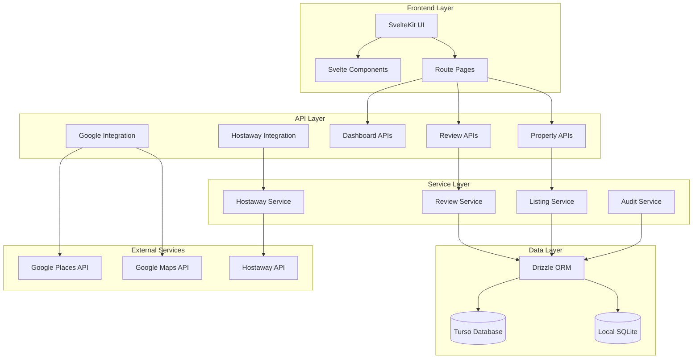
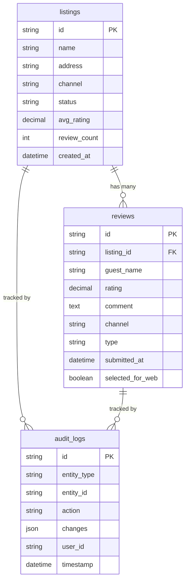
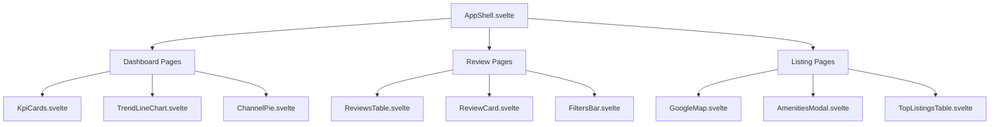

# System Architecture

## Technology Stack

### Frontend Layer
- **Framework**: SvelteKit with TypeScript
- **UI Framework**: Tailwind CSS + SkeletonLabs components
- **Build Tool**: Vite
- **Runtime**: Node.js 22.x (Vercel)

### Backend Layer
- **API Framework**: SvelteKit API routes
- **Runtime Environment**: Node.js serverless functions
- **Database ORM**: Drizzle ORM with TypeScript

### Database Layer
- **Production**: Turso (libsql) - Cloud SQLite database
- **Development**: Local SQLite database (`local.db`)
- **Migration**: Dual-driver support for seamless environment switching

### External Integrations
- **Google APIs**: Places API, Maps API, Geocoding API
- **Hostaway API**: Property management system integration
- **Deployment**: Vercel platform with automatic deployments

## System Design

## Database Architecture

### Schema Design

### Database Features
- **Automatic Migrations**: Schema changes applied via `npm run db:push`
- **Type Safety**: TypeScript types generated from schema
- **Indexing**: Optimized queries with proper database indexes
- **Audit Trail**: Complete activity logging for compliance

## API Architecture

### RESTful Design Patterns
- **Resource-based URLs**: `/api/reviews`, `/api/properties`
- **HTTP Methods**: GET, POST, PUT, DELETE
- **Query Parameters**: Filtering, pagination, sorting
- **Response Format**: Consistent JSON structure

### Error Handling
- **HTTP Status Codes**: Proper error code usage
- **Error Response Format**: Structured error messages
- **Validation**: Input validation on all endpoints
- **Logging**: Comprehensive error logging

## Component Architecture

### Component Hierarchy

### Component Design Principles
- **Single Responsibility**: Each component has one clear purpose
- **Reusability**: Components designed for multiple contexts
- **Props Interface**: TypeScript interfaces for component props
- **Event Handling**: Consistent event emission patterns

## Integration Architecture

### Google API Integration
- **Places API**: Search, details, nearby places
- **Maps API**: Static maps, geocoding, reverse geocoding
- **Error Handling**: API key validation and fallback handling
- **Rate Limiting**: Proper API usage within quotas

### Hostaway Integration
- **Authentication**: OAuth token management
- **Data Sync**: Property data synchronization
- **Mock Data**: Fallback data for development/testing
- **Error Resilience**: Graceful handling of API failures

## Security Architecture

### Environment Variables
- **Sensitive Data**: API keys stored in environment variables
- **Validation**: Required environment variable checking
- **Isolation**: Development vs production configuration

### Data Protection
- **Input Sanitization**: XSS prevention on user inputs
- **SQL Injection Prevention**: Parameterized queries via Drizzle ORM
- **CORS Configuration**: Proper cross-origin request handling

## Performance Architecture

### Database Optimization
- **Query Optimization**: Efficient SQL queries with proper joins
- **Indexing Strategy**: Database indexes on frequently queried fields
- **Connection Pooling**: Efficient database connection management

### Frontend Optimization
- **Code Splitting**: Automatic route-based code splitting
- **Lazy Loading**: Components loaded on demand
- **Asset Optimization**: Optimized images and static assets

### Caching Strategy
- **API Response Caching**: Strategic caching of expensive operations
- **Static Asset Caching**: Browser caching for static resources
- **Database Query Caching**: ORM-level query result caching

## Deployment Architecture

### Vercel Platform
- **Serverless Functions**: Automatic scaling and zero configuration
- **Edge Network**: Global CDN for optimal performance
- **Automatic Deployments**: CI/CD pipeline with GitHub integration

### Environment Management
- **Development**: Local development with hot reloading
- **Staging**: Preview deployments for feature testing
- **Production**: Production environment with monitoring

This architecture supports scalable, maintainable, and performant operation of the Flex Living Reviews Dashboard.
