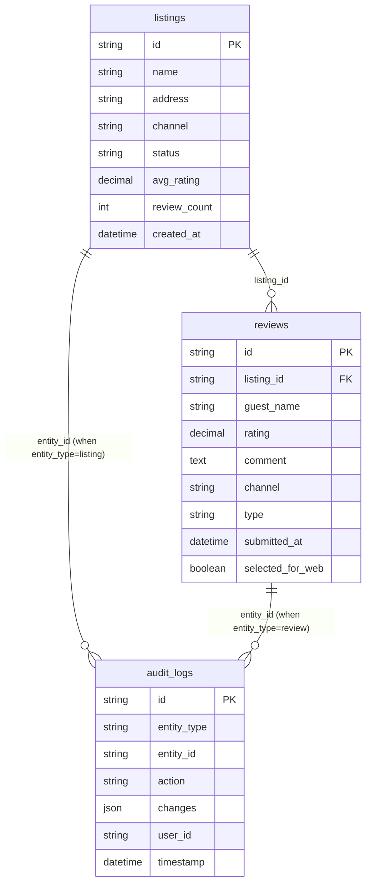

# Database Schema Documentation

## Overview
The Flex Living Reviews Dashboard uses a normalized 3-table database schema optimized for review management and property analytics.

## Database Configuration

### Development Environment
- **Database**: Local SQLite (`local.db`)
- **Driver**: better-sqlite3
- **Location**: Project root directory

### Production Environment  
- **Database**: Turso (libsql cloud database)
- **Driver**: @libsql/client
- **Configuration**: Environment variables (`TURSO_DATABASE_URL`, `TURSO_AUTH_TOKEN`)

## Table Definitions

### listings
Property master data table with calculated review statistics.

```sql
CREATE TABLE listings (
  id TEXT PRIMARY KEY,
  name TEXT NOT NULL,
  address TEXT,
  channel TEXT NOT NULL DEFAULT 'direct',
  status TEXT NOT NULL DEFAULT 'active',
  avg_rating REAL DEFAULT 0,
  review_count INTEGER DEFAULT 0,
  created_at TEXT NOT NULL DEFAULT CURRENT_TIMESTAMP
);
```

**Columns:**
- `id` (TEXT, PRIMARY KEY): Unique property identifier
- `name` (TEXT, NOT NULL): Property name/title
- `address` (TEXT): Property street address
- `channel` (TEXT, DEFAULT 'direct'): Booking channel (airbnb, booking, direct, google)
- `status` (TEXT, DEFAULT 'active'): Property status (active, inactive, archived)
- `avg_rating` (REAL, DEFAULT 0): Calculated average rating from reviews
- `review_count` (INTEGER, DEFAULT 0): Calculated total review count
- `created_at` (TEXT, DEFAULT CURRENT_TIMESTAMP): Record creation timestamp

### reviews
Guest review data with ratings and metadata.

```sql
CREATE TABLE reviews (
  id TEXT PRIMARY KEY,
  listing_id TEXT NOT NULL,
  guest_name TEXT NOT NULL,
  rating REAL NOT NULL,
  comment TEXT,
  channel TEXT NOT NULL DEFAULT 'direct',
  type TEXT NOT NULL DEFAULT 'guest',
  submitted_at TEXT NOT NULL,
  selected_for_web INTEGER DEFAULT 0,
  FOREIGN KEY (listing_id) REFERENCES listings(id)
);
```

**Columns:**
- `id` (TEXT, PRIMARY KEY): Unique review identifier
- `listing_id` (TEXT, NOT NULL, FK): Reference to listings.id
- `guest_name` (TEXT, NOT NULL): Guest/reviewer name
- `rating` (REAL, NOT NULL): Numeric rating (typically 1-5 or 1-10 scale)
- `comment` (TEXT): Review text content
- `channel` (TEXT, DEFAULT 'direct'): Review source channel
- `type` (TEXT, DEFAULT 'guest'): Review type (guest, host, system)
- `submitted_at` (TEXT, NOT NULL): Review submission timestamp
- `selected_for_web` (INTEGER, DEFAULT 0): Boolean flag for web display

### audit_logs
System activity tracking for compliance and debugging.

```sql
CREATE TABLE audit_logs (
  id TEXT PRIMARY KEY,
  entity_type TEXT NOT NULL DEFAULT 'review',
  entity_id TEXT NOT NULL,
  action TEXT NOT NULL,
  changes TEXT,
  user_id TEXT,
  timestamp TEXT NOT NULL DEFAULT CURRENT_TIMESTAMP
);
```

**Columns:**
- `id` (TEXT, PRIMARY KEY): Unique audit log identifier
- `entity_type` (TEXT, DEFAULT 'review'): Type of entity being audited
- `entity_id` (TEXT, NOT NULL): ID of the entity being tracked
- `action` (TEXT, NOT NULL): Action performed (create, update, delete)
- `changes` (TEXT): JSON serialized changes data
- `user_id` (TEXT): User performing the action
- `timestamp` (TEXT, DEFAULT CURRENT_TIMESTAMP): Action timestamp

## Database Indexes

### Performance Optimization Indexes
```sql
-- Reviews table indexes for common queries
CREATE INDEX idx_reviews_listing_id ON reviews(listing_id);
CREATE INDEX idx_reviews_channel ON reviews(channel);
CREATE INDEX idx_reviews_submitted_at ON reviews(submitted_at);
CREATE INDEX idx_reviews_rating ON reviews(rating);

-- Listings table indexes
CREATE INDEX idx_listings_channel ON listings(channel);
CREATE INDEX idx_listings_status ON listings(status);
CREATE INDEX idx_listings_created_at ON listings(created_at);

-- Audit logs indexes
CREATE INDEX idx_audit_entity_type ON audit_logs(entity_type);
CREATE INDEX idx_audit_entity_id ON audit_logs(entity_id);
CREATE INDEX idx_audit_timestamp ON audit_logs(timestamp);
```

## Relationships

### Foreign Key Constraints


## Data Types and Validation

### TypeScript Interfaces
```typescript
// From src/lib/db/listingService.ts
export interface ListingWithStats {
  id: string;
  title: string;
  address: string | null;
  channel: string;
  status: string;
  avgRating: number | null;
  reviewCount: number;
  createdAt: string;
}

// From src/lib/db/reviewService.ts  
export interface ReviewWithDetails {
  id: string;
  listingId: string;
  guestName: string;
  rating: number;
  comment: string | null;
  type: string;
  channel: string;
  submittedAt: string;
  selectedForWeb: boolean;
}
```

### Enum Values
```typescript
// Channel types (listings and reviews)
type Channel = 'airbnb' | 'booking' | 'direct' | 'google';

// Listing status types
type ListingStatus = 'active' | 'inactive' | 'archived';

// Review types
type ReviewType = 'guest' | 'host' | 'system';

// Audit entity types
type EntityType = 'listing' | 'review' | 'user' | 'system';

// Audit actions
type AuditAction = 'create' | 'update' | 'delete' | 'bulk_update';
```

## Migration Management

### Schema Evolution Commands
```bash
# Apply schema changes to database
npm run db:push

# Generate TypeScript types from schema
npm run db:generate

# Seed database with sample data
npm run db:seed

# Migrate existing SQLite data to Turso
npm run db:migrate-to-turso
```

### Migration Scripts Location
- **Schema Definition**: `src/lib/db/schema.ts`
- **Seeding Script**: `src/lib/db/seed.ts`
- **Migration Script**: `src/lib/db/migrate-to-turso.ts`
- **Population Script**: `src/lib/db/populateReviews.ts`

## Database Operations

### Common Query Patterns
```typescript
// Get listings with review statistics (from ListingService)
const result = await db
  .select({
    id: listings.id,
    title: listings.name,
    address: listings.address,
    channel: listings.channel,
    status: listings.status,
    avgRating: listings.avgRating,
    reviewCount: listings.reviewCount,
    createdAt: listings.createdAt,
  })
  .from(listings)
  .orderBy(desc(listings.createdAt));

// Get reviews with listing information (from ReviewService)
const result = await db
  .select({
    id: reviews.id,
    listingId: reviews.listingId,
    guestName: reviews.guestName,
    rating: reviews.rating,
    comment: reviews.comment,
    type: reviews.type,
    channel: reviews.channel,
    submittedAt: reviews.submittedAt,
    selectedForWeb: reviews.selectedForWeb,
    listingName: listings.name,
  })
  .from(reviews)
  .leftJoin(listings, eq(reviews.listingId, listings.id));
```

### Transaction Management
```typescript
// Example transaction for data consistency
await db.transaction(async (tx) => {
  // Update review
  await tx.update(reviews)
    .set({ selectedForWeb: true })
    .where(eq(reviews.id, reviewId));
    
  // Log audit entry
  await tx.insert(auditLogs).values({
    id: generateId(),
    entityType: 'review',
    entityId: reviewId,
    action: 'update',
    changes: JSON.stringify({ selectedForWeb: true }),
    timestamp: new Date().toISOString()
  });
});
```

## Performance Considerations

### Query Optimization
- Use proper indexes for frequently filtered columns
- Implement pagination for large result sets
- Use aggregation queries for statistics calculation
- Batch operations for bulk updates

### Connection Management
- Single database connection per serverless function
- Connection reuse within request lifecycle
- Proper connection cleanup and error handling

This schema supports efficient querying, maintains data integrity, and provides comprehensive audit capabilities for the review management system.
